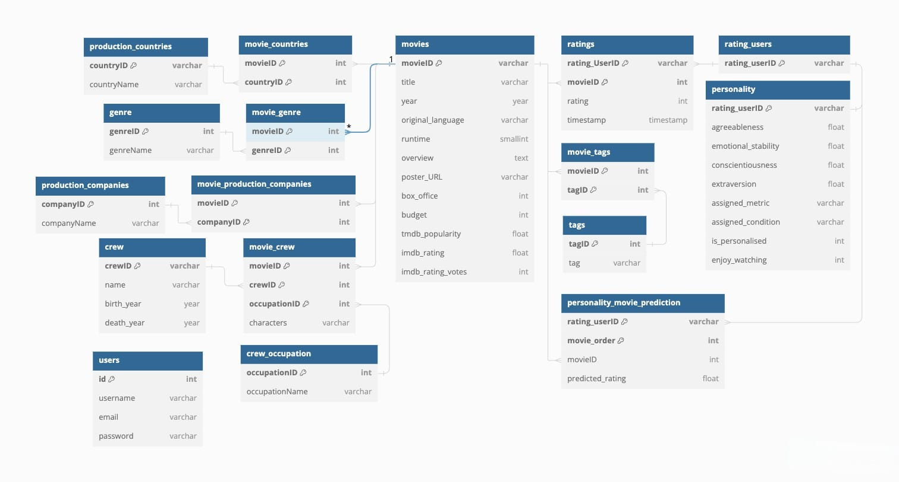

# 🎥 Movie Database Web Application

<br>

## ✨ Features:
- Cover 200,000+ movie metadata and 1,000,000+ ratings
- Docker-based setup allow cross-platform depolyment
- Easy-to-manage MySQL database with a built-in admin interface - phpMyAdmin

<br>

## 📝 Database Architecture
### ERD Diagram: 

For a comprehensive explanation, please refer to [Database Architecture](./Docs/Database_Architecture.pdf).

<br>

## 🚀 Launch Guidelines:

> ### Prerequisites
- Download and install Docker from [Docker's official website](https://www.docker.com/products/docker-desktop/).
- Make sure Docker is running on your system.

> ### Setup Instructions

1. Open the terminal and navigate to the project's root directory.
2. Run the following command to configure the runtime environment and launch the web application:
   ```bash
   docker compose up
   ```
3. Wait for the configuration to complete. You'll see a message in the following form when the server is ready:
   ```
   [System] [MY-XXXXXX] [Server] /usr/sbin/mysqld: ready for connections. Version: 'X.X.X'  socket: '/var/run/mysqld/mysqld.sock'  port: 3306  MySQL Community Server - GPL.
   ```
4. Open your web browser and visit [http://localhost:4000/](http://localhost:4000/) to access the application. On the initial login, extra time is needed to load the song information into the database.

> ### Database Management Instructions
1. Once the application is running, open your web browser and visit [http://localhost:8001/](http://localhost:8001/).
2. Use the following credentials to log into phpMyAdmin:
   - **Username:** movieadmin
   - **Password:** secretpassword
3. Select the **song_recommendation_database** to manage song and user data.

> ### Shutdown Instructions

1. In the terminal where the application is running, press `Ctrl + C` to stop the service.
2. (Optional) To completely remove the container, run:
   ```bash
   docker compose down
   ```

<br>

## 🧩 Tech Stack:
- Deployment: Docker, Docker Compose
- Database: MySQL, phpMyAdmin
- Frontend: HTML, CSS, JavaScript

<br>

## 📄 License:
This project is licensed under the MIT License. See the [LICENSE](LICENSE) file for details.
